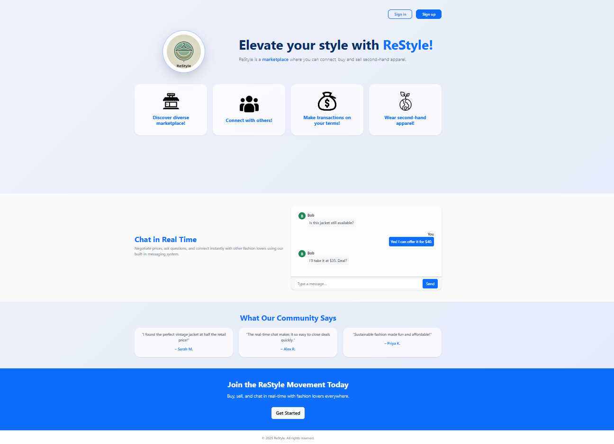
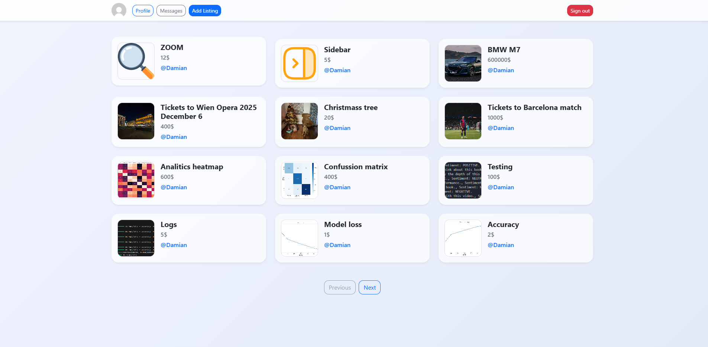
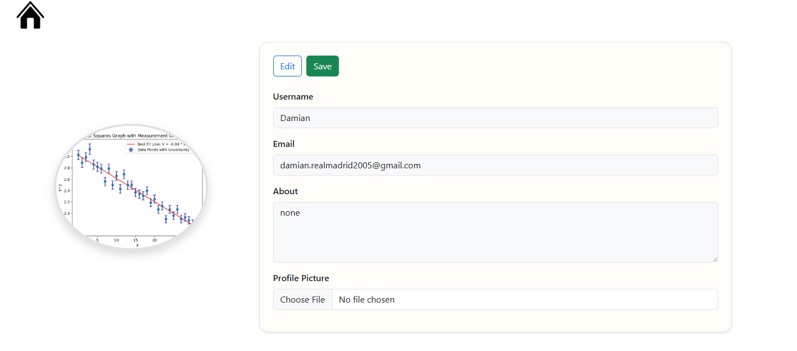
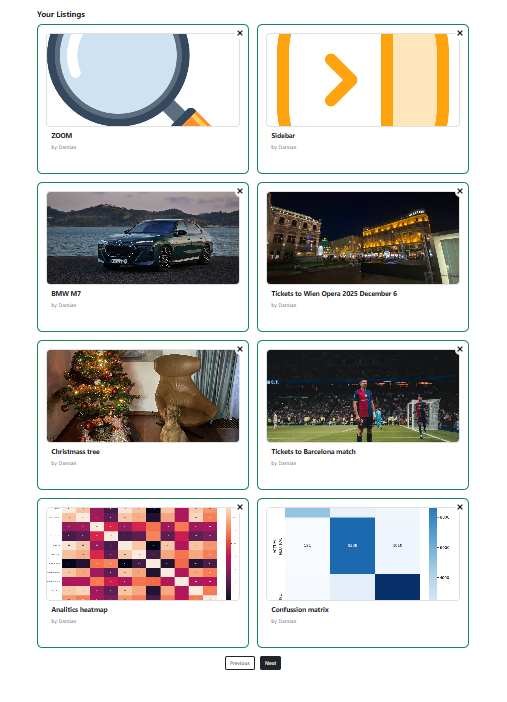
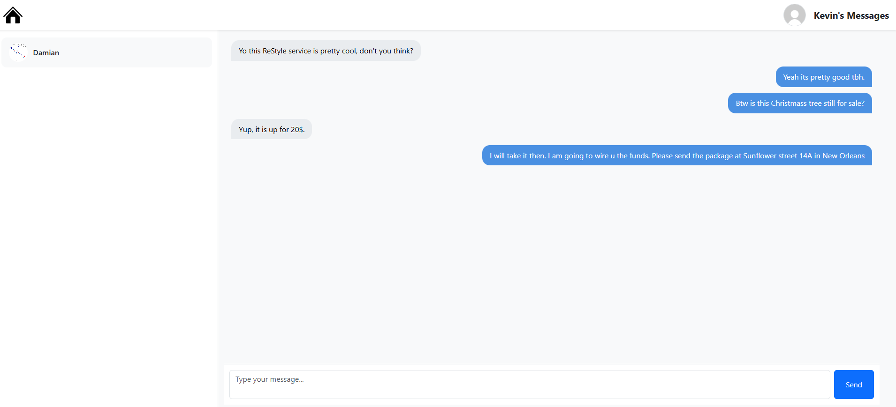
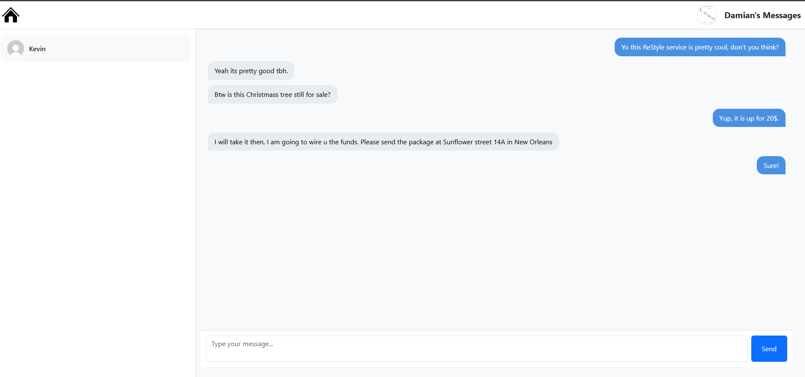

# ReStyle
The app was built and is maintained by Damian Piechocki.
ReStyle is a web service, which allows users to create accounts,
post products on a marketplace and communicate with other potential customers or sellers in real time.
Users have the ability to manipulate their listings as well as to edit their profile information.





<div width="900">
  
  
</div>

## Technologies in use
  -Mongodb
  
  -Flask
  
  -HTML(Jinja templating language) and CSS
  
  -Websockets
  
  -JavaScript
  
## Booting
Run innit.py:
  ```console
  python -u [absolute_path_to_innit.py]
  ```
Alternatively run the dockerfile:
  ```console
  docker build -t restyle .
	docker run -p 3000:3000 restyle
  ```
## Overcome issues
  Handling user account creation and signing up, password hashing

  Vast customisation possibilities within user profiles

  Real time communication between users
  
  Storing and serving uploaded images
  
  Pagination of user-submitted listings
